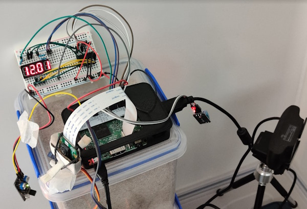

# Pi Panel

This is a hobby project for building a Raspberry Pi based home station and
an online panel. The code is C# / .NET full stack, including the device
application and web front-end.

## Functionality

Current functionality includes:

- Camera images
- Temperature and humidity tracking
- Displaying current weather conditions from [OpenWeatherMap](https://openweathermap.org/api)
- Remote-controller servo linked to camera angle
- 4x7-segment display showing temperature/humidity/time locally

The functionality is likely to be expanded to include things that are useful,
interesting to build or just fun challenges. Some of the future ideas include:

- Add LED indicators on Pi for connectivity / picture timings
- Direct access to video feed from camera

## Architecture

The system consists of following parts:

- A Raspberry Pi with attached cameras, sensors and display
- Device application built for Raspberry Pi with .NET ([Device](./Device))
- Azure IoT Hub where the device is registered and managed
- Azure Blob Storage where the data is persisted
- An admin application with a .NET Web API back-end ([Server](./Device)) and Blazor front-end ([Client](./Device))

## Known Issues

- There are currently some issues with Raspberry Pi (3) and .NET 7 when
using the IoT libraries, so I have decided to use .NET 6 at least for now.

## Physical device set-up

Below is a picture of the current Raspberry Pi set-up. As you might see, it is a collection of various temporary, least-effort solutions.

